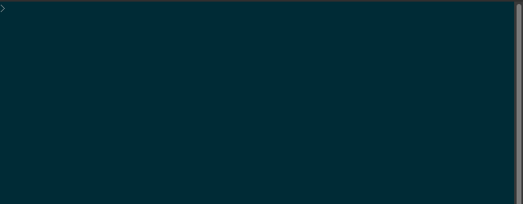
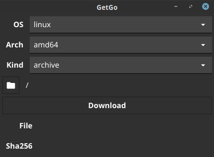

getgo checks https://golang.org/dl/?mode=json to download the latest
stable version of [Go](https://golang.org) and verify its checksum.
The tool won't download the binary if a verified one already exists
locally.

It is command line utility with an experimental GUI mode that is only
half-baked.



## Install

### Pre-built Binaries

Pre-built binaries are available in the [releases section](releases) where you
can find the binary and the sha256sum file.

To verify the binary against the sha256sum, download both files and:

`sha256sum --check <shafile name>`

If you already have Go installed:

`go get lazyhacker.dev/getgo`

### Compile From Source

Example of build command for the CLI and GUI version can be found in build.sh.

## Usage

Just run `getgo` to download the most recent stable archive for the platform it
is running from.  To also extract the archive run it with the '-x' flag:

```
getgo -x <dir to extract to>
```
On Windows, getgo can be told to download the installer with:

```
getgo -kind installer
```

To download to a specific directory:

`getgo -dir ~/Downloads`

To download another OS and/or arch version, use the '-os' and the '-arch' flags:

```
getgo -os windows -arch amd64
```

To get help info:

`getgo -help`

### Full Example

I use getgo make it easier for me to download Go when a new release comes out.

Instead of:

1. Download Go from golang.org.
1. Verify the checksum.
1. Delete the installed version of Go.
1. Untar the downloaded .tar.gz.

It becomes:

```
sudo rm /usr/local/go
sudo getgo -x /usr/local
```

## Experimental GUI version




I'm experimenting with building GUI apps with Go.  [Fyne](https://fyne.io) is a
cross-platform Go GUI toolkit that I started testing.

To try the Fyne version (require [installing Fyne](https://developer.fyne.io/#installing)
and its [dependencies](https://developer.fyne.io/started/#prerequisites)):

```
go get lazyhacker.dev/getgo
go run -tags gui lazyhacker.dev/getgo

```
